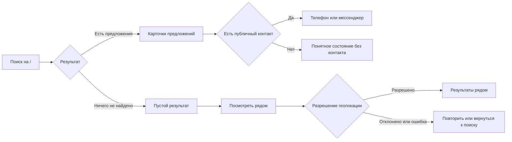
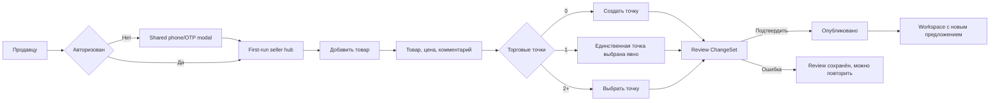
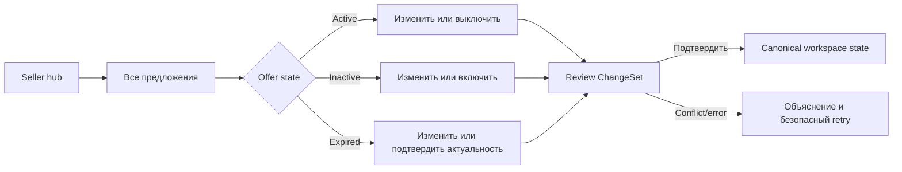

# KAIDA UX reset — navigation and state specification

> **Status:** DRAFT FOR PRODUCT OWNER REVIEW
> **Purpose:** первый обязательный артефакт UI redesign stabilization gate из `EXECUTION_PLAN.md`.
> **Source:** bundled wireframe set `1a`–`5e` (`wf.pdf`), `WIREFRAME_BRIEF.md`, закрытые core contracts и фактические routes.
> **This document is not:** новый roadmap, разрешение на production implementation или замена Slice Contract.

## 1. Вывод ревизии

Вайрфреймы дают полезное направление для композиции, но сейчас это **каталог кадров**, а не цельная модель продукта.
Один и тот же пользовательский экран повторяется как normal/error/empty/future variant, а рядом с рабочим MVP лежат
post-MVP функции. Если переносить 42 кадра буквально, получится перегруженная навигация и интерфейс, который обещает
неработающие возможности.

Для UX reset следует:

1. свести 42 кадра к 11–12 устойчивым surfaces и конечным состояниям;
2. проверить три полные пользовательские цепочки, а не отдельные красивые экраны;
3. не показывать в основной навигации функции, которые ещё не существуют;
4. встроить русский/казахский в shell, состояния, данные каталога и acceptance с первого прототипа;
5. после визуального принятия реализовывать UI поверх существующего core маленькими vertical slices.

Полностью переписывать auth, Seller/Location/Offer, ChangeSet, Search и persistence не требуется.

## 2. Три цепочки для первого статического прототипа

### F1 — покупатель: найти товар и связаться

**Обязательные состояния:** initial, typing, loading, results, empty, offline, server error, contact available,
no public contact, geo request, geo denied/unavailable, nearby results, nearby empty.

**Правила:**

- Search остаётся доступным гостю.
- Один search entry использует одно поведение; header search и page search не должны давать разные результаты.
- Параметр запроса должен переживать reload/back и переключение языка.
- Геолокация запрашивается только после явного действия.
- Buyer coordinates не сохраняются; raw Seller coordinates не показываются.
- В первом прототипе действие контакта живёт на карточке. Отдельная buyer Offer-detail route требует отдельного
  решения, потому что в текущем приложении её нет.

### F2 — новый продавец: опубликовать первое предложение

**Обязательные состояния:** guest/authenticated, OTP request/verify/invalid/expired, first run, draft/dirty,
invalid product, invalid price, zero/one/many locations, submit loading/error, review one item, confirm loading/error,
success.

**Правила:**

- Закрытие Auth возвращает на исходную buyer route и не теряет контекст.
- Уже введённые значения товара не теряются, если в середине понадобилось создать торговую точку.
- Offer не становится buyer-facing до explicit ChangeSet confirmation.
- Отсутствие geo или публичного телефона не блокирует создание/confirm; buyer visibility продолжает определяться
  существующими core rules.
- Фото, AI-ввод и вставка map link не входят в первую реализацию этой цепочки до своих contracts. В прототипе можно
  проверить их место в композиции отдельным необязательным вариантом, не выдавая их за работающую функцию.

### F3 — возвращающийся продавец: изменить состояние предложения

**Обязательные состояния:** workspace loading/error/empty, active, inactive, expired, edit dirty/invalid,
deactivate/activate proposal, ChangeSet review, revision conflict, confirm success/error.

**Правила:**

- Hub даёт краткий обзор и один главный следующий шаг; полный список живёт в Offer Workspace.
- Любое изменение проходит через ChangeSet review.
- После успешного confirm список обязан показать canonical server state без зависимости от способа закрытия sheet/modal.
- Карточка не должна одновременно показывать все возможные действия. Primary action зависит от статуса; остальные
  находятся в компактном secondary menu.
- Contacts и Trading Points доступны из seller navigation, но не смешиваются с редактированием Offer.

## 3. Информационная архитектура

### 3.1 Shared shell

На каждом экране доступны:

- KAIDA logo/home;
- `Русский / Қазақша`;
- `Войти` или компактное account действие;
- понятный переход `Продавцу` из buyer context;
- одинаковые loading/offline/error conventions.

Переключение языка сохраняет route, query, незавершённый локальный form state и разрешённый auth state. Документ получает
актуальный `lang`; все labels, errors, statuses, placeholders, ARIA copy, metadata и catalog-owned names имеют `ru`/`kk`.

### 3.2 Buyer navigation

Для первого прототипа достаточно двух destinations:

| Destination | Route | Когда виден |
|---|---|---|
| Поиск | `/` + canonical query parameter | Всегда |
| Рядом | `/nearby` | Всегда; location запрашивается только после действия |

`Для вас` и read/manage `Интересы` добавляются в primary navigation только вместе с S14. До этого не нужны ни disabled
tabs, ни `скоро` в постоянной навигации.

### 3.3 Seller navigation

| Destination | Target route | Роль |
|---|---|---|
| Обзор | `/seller` | Сводка и следующий шаг |
| Предложения | `/seller/offers` | Полный workspace |
| Точки | `/seller/points` | Location identity и создание точек |
| Контакты | `/seller/contacts` | Seller-level public channels |

На mobile это compact bottom navigation либо один `Ещё` для менее частых разделов после usability check. На desktop —
sidebar или horizontal subnavigation. Нельзя одновременно показывать четыре равносильные tabs и дублировать все четыре
крупными карточками на hub.

### 3.4 Back, deep link и overlay semantics

- Browser Back возвращает на предыдущую surface с сохранённым query/filter/form state.
- Auth modal не меняет URL при contextual entry; direct `/login` использует ту же форму и state model.
- Bottom sheet для create/edit может быть route-backed, если нужен deep link/reload. В противном случае refresh не должен
  молча терять уже отправленный ChangeSet.
- ChangeSet review остаётся addressable (`/seller/change-sets/:id`).
- После confirm Back не возвращает к actionable pending review.

### 3.5 Что уже даёт core

| Capability | Фактическая основа | Вывод для redesign |
|---|---|---|
| Phone/OTP auth и session | Identity module + shared Auth UI | Пересобрать presentation и orchestration, не auth semantics |
| Search и catalog resolution | Search/Catalog modules + `/api/search` | Свести entry points и локализовать catalog/query proof |
| Public Seller contacts | S10 contracts + contacts API | Переоформить настройки и buyer actions, не менять ownership |
| Nearby | S11 + `/api/discovery/nearby` | Пересобрать permission/result states, не хранить buyer geo |
| Seller и торговые точки | Seller/Location modules + owner APIs | Пересобрать first run, cards и selection; сохранить `0/1/2+` rules |
| Offer lifecycle | Offer module | Отображать active/inactive/expired без новой трактовки |
| Create/update confirmation | SellerChangeSet modules/routes | Сохранить explicit review/confirm и atomicity |
| RU/KZ locale layer | Отсутствует | Новый cross-cutting slice до production UI |
| Seller-content translation | Отсутствует | Нужны product model, persistence/fallback и Search rules |

### 3.6 UI data projection

| Surface | Нужные данные | Не показывать / не выдумывать |
|---|---|---|
| Search card | Offer id, localized catalog product name, Seller display name, public contacts?, Location name/address, price/unit, seller comment? | Raw geo, identity phone, fake rating, fake media |
| Nearby card | Search-card projection + rounded distance | Buyer coordinates, Seller coordinates, precise route telemetry |
| Seller hub | Count of owned Locations, Offer counts by real status, small recent/attention sample | Revenue/views until analytics contract, fake plan limits |
| Offer Workspace | Owned Offer id, product, Location, price/unit, comment, status, last confirmed time | Direct mutation controls that bypass ChangeSet |
| Location choice | Owned Location id, name, address, type, geo-present indicator | Coordinates and foreign Locations |
| ChangeSet review | ChangeSet id/status/timestamps, Seller, items with action/product/Location/price/comment/result | Partial apply and invented moderation status |
| Locale | Active locale, localized KAIDA/catalog fields, translation provenance for seller content | Silent mixed-language fallback |

Prototype fixtures используют именно эти projections. Если layout требует новых данных, это фиксируется как data gap,
а не заполняется декоративным значением.

## 4. Общая state model

Все surfaces используют одни и те же понятия:

| State group | States | UX requirement |
|---|---|---|
| Async | idle · loading · success · empty · offline · server-error | Loading не стирает контекст; error содержит retry |
| Auth | guest · requesting-code · verifying · authenticated · session-expired | Intent и введённые данные сохраняются |
| Form | pristine · dirty · invalid · submitting · submit-error · submitted | Ошибка привязана к полю и имеет summary для a11y |
| Location permission | unknown · requesting · granted · denied · unavailable | Нет auto-prompt и fake global fallback |
| Offer | active · inactive · expired | Status, primary action и buyer visibility не смешиваются |
| ChangeSet | draft · pending · confirming · confirmed · failed/conflict | До confirmed core truth не меняется |
| Contact | available · absent | Отсутствие канала показано честно, fake CTA отсутствует |
| Locale | ru · kk | Route/state сохраняются; fallback наблюдаем и одинаков везде |

Не нужно рисовать отдельный экран для каждой комбинации. Это variants одной surface в прототипе и acceptance matrix в
Slice Contract.

## 5. Реестр всех 42 кадров и решение по каждому

### 5.1 Tier 0 / первый набор (`1a`–`1l`)

| ID | Содержание | Решение |
|---|---|---|
| `1a` | Новое предложение | **CORE / F2**; invalid price становится state, не отдельным экраном |
| `1b` | Выбор/создание торговой точки | **CORE / F2**; map-link variant остаётся за geo-fallback contract |
| `1c` | Пакет + свободный AI input | **DEFER** из первого прототипа; обычный batch остаётся отдельной проверяемой веткой позже |
| `1d` | Карточка предложения в Search | **CORE / F1** |
| `1e` | Пустой Search | **CORE / F1**; один явный CTA в Nearby |
| `1f` | Запрос Nearby | **CORE / F1** |
| `1g` | Расширенная карточка/контактные действия | **MERGE WITH `1d`**; отдельная detail route пока не доказана |
| `1h` | Схема рынка `скоро` | **REMOVE FROM PROTOTYPE**; хранить как insertion candidate, не как пользовательскую destination |
| `1i` | Guest auth | **CORE / F2**; shared component для modal и direct `/login` |
| `1j` | Seller analytics summary | **DEFER** до S33 |
| `1k` | Freshness | **DEFER** до approved freshness contracts |
| `1l` | Promotion | **DEFER** до monetization/promotion contracts |

### 5.2 Tier 1 (`2a`–`2i`)

| ID | Содержание | Решение |
|---|---|---|
| `2a` | Seller hub | **CORE / F2 + F3** |
| `2b` | First-run seller / первая точка | **CORE / F2**, объединить с hub zero-state |
| `2c` | Карточки и редактирование точки | **KEEP**, вне happy-path первого прототипа |
| `2d` | Выбор точки при `2+` | **CORE / F2** |
| `2e` | Seller Offer Workspace | **CORE / F3** |
| `2f` | Seller contacts | **KEEP** как secondary branch; не встраивать в каждую Offer form |
| `2g` | ChangeSet review | **CORE / F2 + F3** |
| `2h` | Nearby results/empty | **CORE / F1** |
| `2i` | Direct `/login` | **MERGE WITH `1i`** как второй entry одного auth state machine |

### 5.3 Tier 2 (`3a`–`3g`)

| ID | Содержание | Решение |
|---|---|---|
| `3a` | Seller Offer Workspace | **CORE / F3**; списочная поверхность, отдельная от формы `1a` |
| `3b` | Напоминание о свежести (два порога) | **DEFER** вместе с `1k` до approved freshness contracts |
| `3c` | Bulk-подтверждение «протухающих» | **DEFER** вместе с `3b`; это freshness, а не пакетное создание Offer |
| `3d` | Search sorting | **DEFER** до Sorting A/B после freshness |
| `3e` | M1 photo | **DEFER** до real media contract; не использовать декоративную fake photo |
| `3f` | `Для вас` | **DEFER** до S14 |
| `3g` | Мои интересы | **DEFER** до S14 read/manage side |

**Исправление нумерации (2026-09-23).** Первая редакция этой таблицы подписывала `3a`/`3b`/`3c` как
«Одиночное создание/редактирование Offer», «Product-first seller step» и «Batch offer entry/review». Это неверно:
порядок Tier 2 в `WIREFRAME_BRIEF.md` — Offer Workspace, напоминание о свежести, bulk-подтверждение, и автор
артефакта подтвердил именно его в сопроводительной записке прохода 3. Пакетное создание Offer со свободным
вводом — это `1c`, а не `3c`. Product-first onboarding остаётся требованием цепочки F2 (раздел 2.1), но отдельного
кадра в артефакте под него нет.

### 5.4 Tier 0 completion/system states (`4a`–`4i`)

| ID | Содержание | Решение |
|---|---|---|
| `4a` | Loading | **SHARED STATE**, показать representative variants в прототипе |
| `4b` | Network/offline error | **SHARED STATE** |
| `4c` | Server error | **SHARED STATE** |
| `4d` | Invalid price | **STATE OF `1a`**, не новая page |
| `4e` | Paste map link | **STATE OF `1b`**, после geo-fallback contract |
| `4f` | AI draft review | **STATE OF `1c`**, defer |
| `4g` | Offer without contact | **STATE OF `1d`/`1g`, CORE / F1** |
| `4h` | Empty Search → Nearby | **STATE OF `1e`, CORE / F1** |
| `4i` | Promotion plan limit | **STATE OF `1l`**, defer |

### 5.5 Tier 3/4 (`5a`–`5e`)

| ID | Содержание | Решение |
|---|---|---|
| `5a` | Notifications | **DEFER** до S23 |
| `5b` | Tariff/subscription | **DEFER** до S25–S27 |
| `5c` | Promotion/payment | **DEFER** до S28–S29 |
| `5d` | Analytics drill-down | **DEFER** до S33 |
| `5e` | Market/reviews/video placeholders | **REMOVE FROM PRIMARY UI**; это backlog markers, не screens |

Итог: 42 reference frames дают примерно **12 surfaces**, около **28 meaningful states**, три core flows и набор
отложенных capabilities. Число `42` не должно становиться числом routes или компонентов.

## 6. Чего не хватает

### P0 — решить до или внутри первого прототипа

1. **RU/KZ shell и реальный казахский текст.** Сейчас в wireframes этого нет.
2. **Единое поведение seller-authored content.** Рекомендация для прототипа: автоматический перевод по умолчанию,
   заметная возможность увидеть оригинал и исправить обе версии; machine-translated value не выдаётся за подтверждённый
   продавцом. Нужны failure/fallback и правила повторного перевода после редактирования оригинала.
3. **Desktop rules.** Local PDF содержит mobile composition; desktop нельзя решать простым растягиванием карточек.
4. **Одна primary navigation model.** В наборе соседствуют buyer tabs, seller tabs и будущие disabled destinations.
5. **Back/close/reload semantics.** Особенно для Auth, bottom sheets, незавершённого Offer draft и confirmed ChangeSet.
6. **Draft preservation.** Product-first onboarding обязан пережить Auth и Location setup.
7. **Success states.** Нужен видимый результат после create/edit/activate/deactivate, а не только закрытие overlay.
8. **Permissions and recovery.** Geo denied, unavailable, timeout, retry и возврат в обычный Search.
9. **Long-content proof.** Длинный казахский copy, длинные seller names/addresses/comments, price/unit и 2+ contacts.
10. **Accessibility behavior.** Focus order, focus return, keyboard, screen reader labels, live regions, reduced motion,
    minimum target size и contrast.

### P1 — закрыть до production implementation соответствующего slice

- canonical Search URL/query and history behavior;
- auth resend/timer policy, если она появится в UI;
- map-link parse/preview/failure contract;
- exact locale persistence and fallback ownership;
- seller translation storage, moderation/correction and Search indexing in both languages;
- revision-conflict copy and recovery;
- skeleton strategy без layout shift;
- observability для translation failures и broken external contact links.

### Недостаток самого исходного артефакта

Локальный `wf.pdf` пригоден как композиционная ссылка, но не как pixel/handoff source: это длинный raster composite,
microcopy и размеры трудно инспектировать, desktop отсутствует, а поздние Tier 3/4 описаны полезнее в brief, чем в PDF.
Поэтому typography, spacing, responsive behavior и component states должны фиксироваться в прототипе и Design System,
а не сниматься с PDF по пикселям.

## 7. Что излишне

### По продукту

- Tier 3/4 в первом прототипе: notifications, tariff, payment, promotion, analytics, market map, reviews, video.
- `Скоро`/disabled destinations в постоянной навигации. Они забирают внимание и создают ложное обещание.
- AI/freeform и photo controls до end-to-end capability.
- Sorting до утверждённых freshness/ranking semantics.
- Отдельные pages для error/empty/invalid variants — это состояния существующей surface.
- Дублирование direct login и modal login разными формами/state machines.
- Дублирование Search в header и body с разным submit behavior.

### По композиции wireframes

- Почти каждый блок имеет одинаковую тяжёлую рамку и одинаковый фиолетовый акцент; из-за этого CTA, summary и
  secondary information конкурируют друг с другом.
- Слишком много поясняющего текста остаётся на каждом повторном посещении. Объяснение нужно first run и в context help;
  рабочая поверхность должна быть короче.
- Seller cards пытаются одновременно быть summary, form, status, analytics и action menu. Это повышает плотность и
  делает mobile scan медленным.
- Несколько равносильных primary buttons на одном экране. Для каждого state нужен один следующий шаг.
- Dark theme сам по себе допустим, но muted text и тонкие purple outlines требуют отдельной contrast-проверки. Цвет не
  должен быть единственным носителем статуса.

## 8. Responsive rules вместо 42 desktop-макетов

| Surface | Mobile | Desktop |
|---|---|---|
| Buyer Search | Одна колонка, sticky search/action по необходимости | Search header + max-width results; 2–3 card columns только если карточка не теряет hierarchy |
| Nearby | Permission/result в одной колонке | Results + optional explanatory side panel; без постоянной карты до отдельного решения |
| Seller hub | Summary, attention block, один CTA | Summary + recent/attention panels в 2 columns |
| Offer Workspace | Cards/list, status-first | Table/list либо roomy cards; actions не зависят от hover |
| Create/edit | Full-screen step или bottom sheet | Centered side panel/dialog с той же state machine |
| ChangeSet review | Последовательный diff | Summary + sticky confirmation panel |
| Points/contacts | Cards/forms по одной колонке | Master/detail только если сохраняется explicit selection |

Общие breakpoints берутся из Design System. Контент имеет readable max-width; desktop не растягивает mobile form на всю
ширину. Все essential actions доступны touch, keyboard и pointer.

## 9. Состав первого fixture-driven prototype

Прототип должен содержать только:

1. shared shell с рабочим `Русский / Қазақша`;
2. F1: Search results, empty → Nearby, no-contact, geo denied и retry;
3. F2: seller entry/Auth, first-run, product draft, `0/1/2+` Location choice, ChangeSet review, success;
4. F3: seller hub, Offer Workspace, edit/deactivate/activate, conflict/error, refreshed success;
5. mobile и desktop layouts для ключевых surfaces;
6. switchable fixture states без API/DB wiring.

Не нужны в первом prototype: batch, AI, photo upload, sorting, freshness notifications, `Для вас`, Interests management,
promotion, payments, tariffs, analytics, reviews, market map и video.

## 10. Визуальный acceptance gate

Product Owner принимает prototype только если:

- каждую из F1–F3 можно пройти от entry до результата без объяснений разработчика;
- на каждом шаге понятен один главный следующий action;
- Back/close/error/retry не теряют важный контекст;
- RU и KZ версии проходимы целиком, включая errors и empty states;
- mobile и desktop сохраняют одну hierarchy;
- будущие возможности не занимают primary navigation;
- статусы Offer и ChangeSet понятны без чтения длинного help text;
- no-contact и geo-denied не выглядят как сломанный интерфейс;
- после confirm виден обновлённый canonical state.

Только после этого создаётся новая UI branch от актуального `main`, а production work разбивается на compact Slice
Contracts. Экспериментальная `slice/seller-offer-workspace` не является base branch нового UI.

## 11. Принятые и оставшиеся Product Owner решения

Принято 2026-09-23:

1. **Перевод seller-authored content:** automatic translation + доступный original + fallback к original; machine output
   не становится единственным сохранённым текстом. Полная модель — `FEATURE_MAP.md` и будущий localization contract.
2. **Map-link:** утверждённый необязательный geo-fallback вне основной F2; activation только на своём stage.

Остаётся подтвердить при финальной visual acceptance исправленного прототипа:

1. **Seller mobile navigation:** четыре destinations сразу или три основных + `Ещё`.
2. **Отдельная buyer Offer detail page:** до media/reviews действия остаются на карточке; отдельная route не появляется
   без нового решения.
