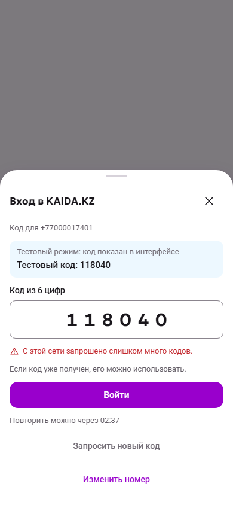
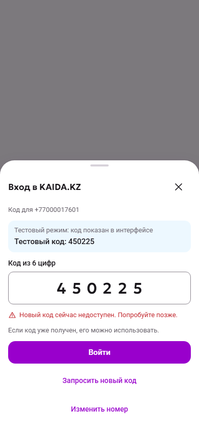

# auth-otp-source-protection — acceptance handoff

Implementation PR: [172](https://github.com/RashRosh/KAIDA.KZ-2.0/pull/172), based on approved docs merge60f1f4a4f4b8e2661389dc1a145a931f8b6613c3 (PR171). Manual acceptance is PENDING; no implementation merge or checkpoint tag is authorized. Exact final head and CI receipts are recorded in CURRENT_STATE/the PR, rather than embedding this file's own commit hash.

## Scope and evidence

- Existing canonical-phone60s/5-per15min and five-guess policy remain unchanged. New source quota:20 committed issuances/exact normalized IP/rolling15min, no source cooldown. The source/phone checks, both charges and challenge replacement commit together. Denials preserve the current code and consume neither allowance. Test delivery only.
- Supported OFF/direct local mode remains the default. Enabled reference uses a separate loopback ingress, an internal backend network and no published app port. The edge overwrites forged source headers; invalid/multiple/missing values fail closed. IPv4/mapped IPv6 and equivalent IPv6 normalization, cross-source same-phone contention and concurrent final-slot admission are covered by focused tests.
- Additive0027 upgrade/repeat proof compares every existing public table's full rows, including active challenges/sessions; both new tables start empty. No old-table mutation, dev migration, R2 dump exclusion or photo change.
- Persisted source state survives restart. Independent supervised cleanup runs at startup/every300s; a real failed sweep exited, Docker restarted it, and a fresh sweep restored issuance. Stale cleanup blocked issuance while a real existing code verified. A scheduled300s sweep deleted23 expired synthetic events without intervening OTP requests in the recorded final interval. Rotation pauses are persisted and consumed once; restore requires a fresh15min quarantine before enablement. Live24h breach latches an incident requiring explicit operator remediation/acknowledgement.
- [Reference-stack receipt](evidence/reference-stack.json), [final patched ingress/app/database restart](evidence/final-ingress.json), [resource/fixture IDs](evidence/resources.json), [actual UI receipt](evidence/ui-verification.json), [actual unavailable/recovery receipt](evidence/unavailable-ui.json). Raw private env/keys/dumps and issued-code files stay outside Git in tmp/auth-source-evidence. Screenshots contain synthetic test codes only.

## Verification and limits

Local Windows x64, Node24.14.1/pnpm11.28.5; Chromium mobile RU. Isolated Docker Linux amd64, PostgreSQL18, Node24.19.0/Next16.3.8. Existing low-memory build settings (one worker, webpack,1536MiB Node heap) passed without OOM or Docker resource changes. Local522 unit tests,11 new source/migration integration tests and focused existing-auth regression were exercised. All24 local focused browser checks completed; the second Windows runner stalled at teardown and was interrupted. An early broad integration run hit the existing S10 five-second migration timeout under simultaneous build pressure; its isolated retry passed unchanged. Required full final-SHA branch CI supplies the authoritative complete regression proof; do not accept intermediate-head CI as the final gate.

Current styles/layout/fonts/controls/navigation are preserved. Only approved guidance/countdown/states and the muted transparent disabled resend selector were added. Actual proxy429/503 screenshots below are separate from E2E's explicitly labelled response fixtures. The latter prove modal handling, not source trust.320px and explicit doubled-text checks found no horizontal overflow; enlarged sheets scroll vertically. Physical-device/OS-scaling/screen-reader acceptance is not claimed; KK copy remains provisional. Countdown changes do not announce each second; readiness has a polite hidden announcement.

Security patch/scan details and exact image/module versions are in [security evidence](evidence/security.json). App Node dependencies/lockfile are unchanged. Local ingress security changes are isolated in ops/auth-otp-source; the generic deployment stack is not upgraded or approved by this slice. Existing OS/Go/braces exceptions remain isolated-local-only. Persistent cleanup has a real image/service healthcheck; the one-off tools-health exception is not extended to it. No new security exception is silently accepted.

## Manual checklist

Open [disposable fixture controls](http://127.0.0.1:3204) and [actual login](http://127.0.0.1:3200/login) in separate tabs. Controls are temporary local test tooling, not a new product menu; they touch only recorded synthetic acceptance resources. A fixture reset is not evidence of product recovery.

Use a fresh private browser window for each login scenario, or log out through the existing More screen before starting the next one. Keep the active code window open when switching to the fixture-control tab.

1. Reset normal login; use +77000017601. Request the displayed test code and sign in. The original layout and destination remain intact.
2. Prepare the source-limit fixture; use +77000017602 as its20th request. Wait the ordinary60s phone countdown, then select the existing resend text action. See the source-limit message/countdown and muted non-activating resend. Enter the already displayed code and sign in while issuance is blocked.
3. Keep that fixture without resetting it. After its source allowance naturally expires (about4min from preparation), +77000017603 can request a fresh code and sign in. Changing/reloading the phone before expiry must not bypass the server limit.
4. Reset normal login, request +77000017601's code and wait60s. Use Simulate stale cleanup in the control tab, then resend in the login: “Попробуйте позже”, no invented retry time, existing code still usable. Recover in the control tab: worker unpauses and a real sweep commits; active allowances remain intact. Verify issuance/login recovers subject to the phone policy.

## Preserved data and remaining gates

Port3000 remains the accepted buyer-report checkpoint/private snapshot: build nQyjy2OyyBc-9HyRYFK5V, checkout tmp/buyer-reports-checkpoint-3000 at51b2425ad099458e7c92aff30952745bdb818aa0, DB kaida_checkpoint/container kaida-checkpoint-3000-postgres, photos tmp/auth-otp-closure-private/photos. Reporting/source protection remain OFF there. Original dev database/photos, personal files and195 staged research files are untouched.

Production source enablement needs verified trusted-proxy/perimeter topology and approved backup/WAL/log retention/erase policy. Live-table deletion is not erasure of backups or logs. Shared networks may temporarily block each other (approved tradeoff); distributed IPs, IPv6 rotation, deliberate victim-phone exhaustion and general traffic flooding remain outside this protection. Real SMS, real-user reporting/public launch remain unauthorized. Voice and translation research remain paused. STOP for PO manual acceptance.
